# Overview

The following REPO is divided into five sub-projects:
* SIMULATION
* caroDeepSeg
* caroDeepMotion
* speckleTracking
* textureImprovment
* statisticalModelSimulation

Each part is synthetically described below. All requirements are common to python projects and available in the *requirements.txt* file.

# SIMULATION
All this code run in *matlab* and *cuda*. For one simulation, the process is as follow:
1. Make phantom.
2. Simulation.
3. Beamforming.

The whole process can be performed locally, but the simulation step is very time consuming. Therefore the phantom and simulation are performed on CREATIS's cluster and the beamforming can be performed locally, provided you have a GPU on your computer.

### Run locally
The functions to run are in *SIMULATION/run_local*. It contains several functions:
* run_mk_phantom.m
* run_simulation.m
* run_beamforming.m

#### *<u> run_local/run_mk_phantom.m </u>*
This function call the another function *mtl_cores/fct_run_mk_phantom* which takes as input the path to the database (path to the images), the path to save the phantom, the path to the simulation parameter (.json file) and some additional information (extra_info) to write in the name of the saved file.

The output is structured as follow:
```sh
|── pres/
|    |── img_name/
|    |    |── img_name_id_001_extra_info/
|    |    |    |── bmode_result/               
|    |    |    |    |── results/                (bmode images constructed after beamforming)
|    |    |    |── parameters/                  (copy of the .json to track the parameters)
|    |    |    |── phantom/                     (phantom used for simulation)
|    |    |    |── raw_data/
|    |    |    |    |── exec_/                  (execution time of tx event)    
|    |    |    |    |── raw_/                   (radio frequency (RF) signals for each tx event)
```

Below an example of the generated phantom.
<p align="center">
    
</p>

During the process, a sequence of phantom with a controlled displacement field is applied on the scatterers. The phantom at time *t2* will be stored in:
```sh
|── pres/
|    |── img_name/
|    |    |── img_name_id_002_extra_info/
|    |    |    |── bmode_result/               
|    |    |    |── parameters/
|    |    |    |── phantom/
|    |    |    |── raw_data/
```
Note that depending of the chosen motion, only pair of images can be generated (modify the .json for this purpose):
* Elastric displacement field   &rarr;  pair of images.
* Gaussian                      &rarr;  as many pairs as you want.
* Affine transformation         &rarr;  as many pairs as you want.

Below an exemple of elastic displacement field applied to jacket:

<p align="center">
    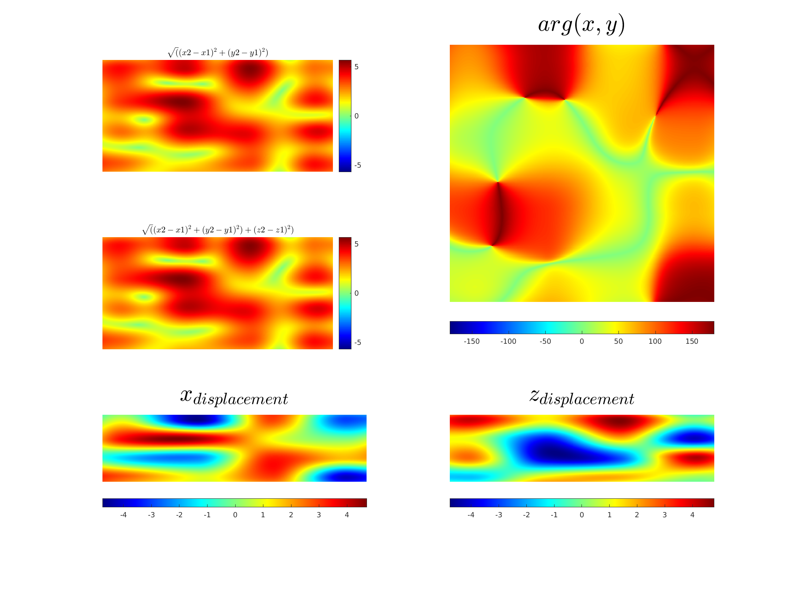
</p>


#### *<u> run_local/run_simulation.m </u>*
This function has to be run after once the phantom is created. It calls the function *mtl_cores/fct_run_wave_propagation.m*. This one takes as argument the path to the phantom, the path to the parameters and the id of the transmitted element. Then the function writes the radiofrequency(RF) signal in path_res/img_name/img_name_id_001_extra_info/raw_data/_raw. 

Below an example of the generated phantom.

<p align="center">
    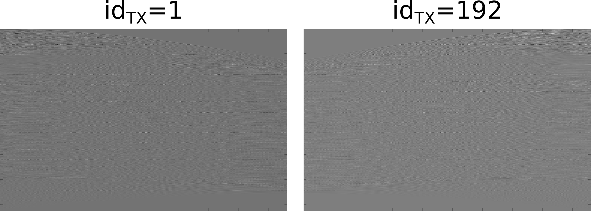
</p>

The simulation applies synthetic aperture. Thus for each id tx, each element of the probe receives signals. The image above are the reveived signal for id tx=1 (left) and for id_tx = 192 (right) for a probe of 192 elements.

#### *<u> run_local/run_beamforming.m </u>*
This function has to be run at the end. It calls the function *mtl_cores/fct_run_image_reconstruction.m*. The beamforming is performed on GPU.
Below an example of a real image convert to B-mode image (a jacket):
<p align="center">
    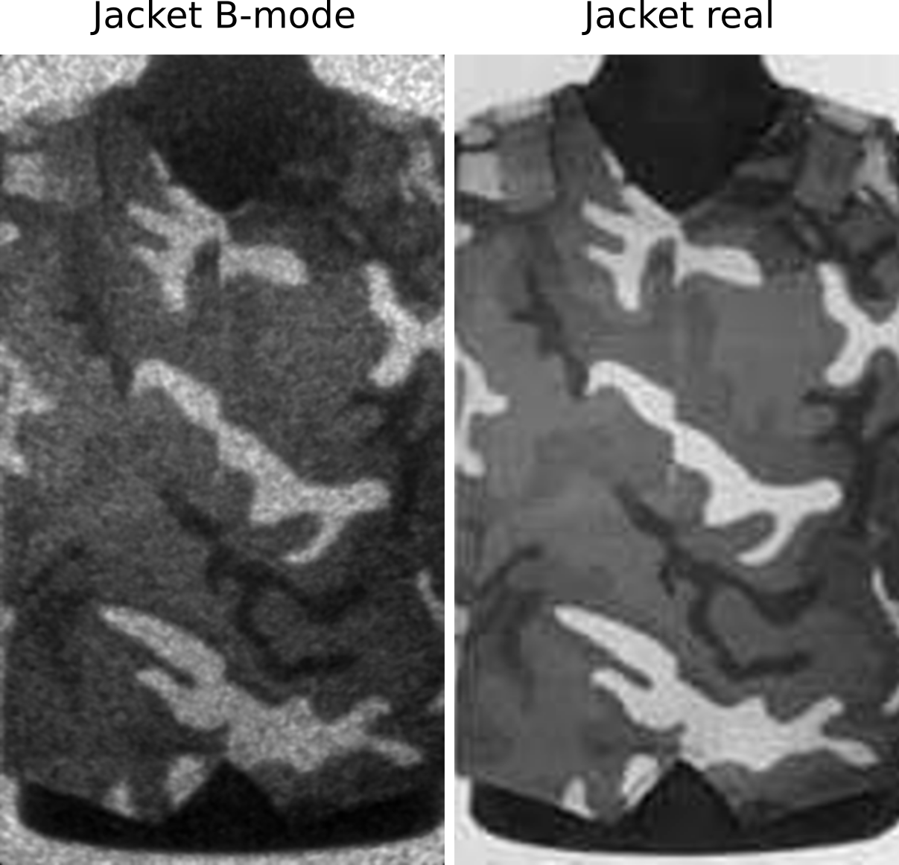
</p>

##### *<u> How tu run on GPU? </u>*
To run the beamforming on GPU, first check your GPU's architecture. For linux user, run in a terminal:
```sh
nvidia-smi -q | grep Architecture
```
Then you have to compile the '*.cu*' locating in SIMULATION/cuda/*.cu. For this, for Pascal architecture, run:
```sh
bash compile_PASCAL.sh
```
You can easily create a new compile.sh for a different architecture by modidying the sm_xy number by looking in the following [link](https://docs.nvidia.com/cuda/cuda-compiler-driver-nvcc/index.html#gpu-compilation).

### Run on cluster 

The cluster uses *PBS Scheduler*. Once your logged to the cluster, each function is handle by python scripts in *SIMULATION/run_cluster/*. 

#### *<u> run_cluster/run_CLUSTER_mk_phantom.py </u>*

Change the parameters in *run_CLUSTER_mk_phantom.py*, and it will make the phantom for each image in the database. It can process *TIFF*, *JPEG* and *DICOM*.

#### *<u> run_cluster/run_CLUSTER_pipeline.py </u>*

Change the parameters in *run_CLUSTER_pipeline.py*, and it will run the simulation for each image in the specified directory. It uses a job array, thus each tx element is run in parallel. 

#### *<u> run_cluster/run_CLUSTER_beamforming_folders_sta.py </u>*

It runs beamforming using GPU's of the cluster. For this purpose, first compile the *\*.cu* according to the architecture you plan to use, then adapt the flag in SIMULATION/run_cluster/pbs/beamforming_sta.pbs according to the architecture:
```sh
qsub -I -lnodes=1:ppn=1:volta:gpus=1 -qgpu      (volta architecture)
qsub -I -lnodes=1:ppn=1:turing:gpus=1 -qgpu     (turing architecture)
qsub -I -lnodes=1:ppn=1:ampere:gpus=1 -qgpu     (ampere architecture)
```

## Handle simulation results
Once RF signals and the B-mode image are generated, to sort success from the computer to another folder, run:
```sh
run_sort_res.sh
```

Sometimes, tx event fails during simulation. It allows to detect simulation error. After executing the previous function, you can execute the following function, specifying the correct directory to re-run failures:
```sh
python SIMULATION/run_cluster/run_CLUSTER_failures.py
```
Then you have to beamformed the image one more time and run *run_sort_res.sh*.

# caroDeepSeg

*caroDeepSeg* is a patch-based approach to segment the intima-media complexe in the far of the common carotid artery. *caroDeepSeg/* contains codes for the following application:
* Generate database for training.
* Split patient for generating training/validation/testing subset.
* Training.
* Evaluation.

More information about the method can be found [here](https://hal.science/hal-03897937/document).

As before, the code can be run locally and remotely on the cluster. Only locally part will be described, refer to the document for the cluster and/or just look at *caroDeepSeg/run_cluster*.

## Run locally

Each function to run is in the folder *package_cores*. Also, each set of parameters is in *package_parameters*. For example, to run the function *package_cores/run_database_CUBS.py*, modify *package_parameters/set_parameters_database_CUBS.py*.

### *<u> package_cores/run_database_CUBS.py </u>*

This function split patients into patches. Run in a terminal:
```sh
python package_cores/run_database_CUBS.py -param set_parameters_database_CUBS.py
```

Below an example of patches at 3 different horizontal location:
<p align="center">
    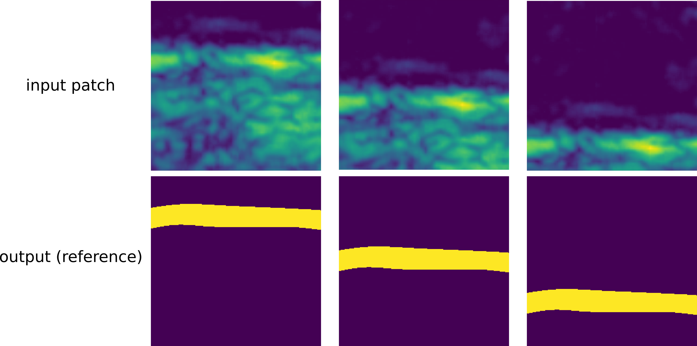
</p>

### *<u> package_cores/run_split_data.py </u>*
This function split patients into training/validation/testing steps. Note that we split patient and not patches. Run in a terminal:
```sh
python package_cores/run_split_data.py
```
For this function only, we do not parse parameters. Please adapt your path to read and save results in *package_cores/run_split_data.py* itself. 
This function simply creates *.txt* containing the name of the patient splited into subsets, and apply a k-fold cross validation. The output is structured as follow::
```sh
|── pres/
    |── f0/
        |── training.txt
        |── validation.txt
        |── testing.txt
    ...
    |── fk/
        |── training.txt
        |── validation.txt
        |── testing.txt
```

### *<u> package_cores/run_training_seg.py </u>*

This function launch training process. Run in a terminal:
```sh
python package_cores/run_training_seg.py -param set_parameters_training_seg_template.py
```

Below an example of data save during training:
<p align="center">
    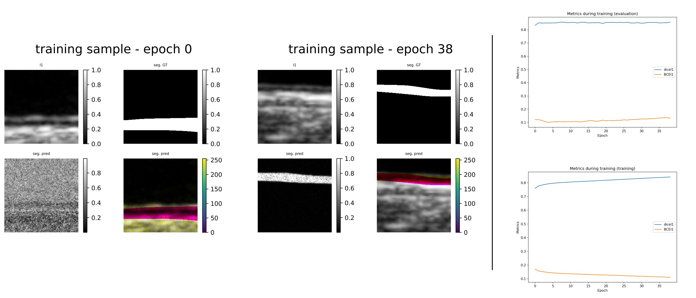
</p>

### *<u> package_cores/run_segment_full_roi.py </u>*
This function load the trained architecture and apply the full postprocessing pipeline to segment the intima-media complexe. Run in a terminal:
```sh
python package_cores/run_training_seg.py -param set_parameters_training_seg_template.py
```

One mode ise proposed to segment the IMC: a semi-automatic method which means that a homemade GUI is used to detect the far wall of the intima-media complexe. 
Below are the commands for using the home interface:
* left click: set a point
* ctrl+left click: leave the graphical interface
* scroll click: reset


To detect the _FW_, a minimum of four clicks are required:
1. *First click*: left border of the *ROI* (click midway distance between the *LI* and *MA* interface).
2. *Second click*: right border of the *ROI* (click midway distance between the *LI* and *MA* interface).
3. *Third click*: point between the left border of the *ROI* and the left border of the image (click midway distance between the *LI* and *MA* interface).
4. *Fourth click*: point between the right border of the *ROI* and the right border of the image (click midway distance between the *LI* and *MA* interface).
5. You can add as many points as you want to shape the curve after those four clicks, cubic spline interpolation is used to adjust the curve.

The _ROI_ is contained between the two red vertical lines and the algorithm segments the _CCA_ between the two bleu vertical lines. This allows for a narrow region to be segmented, this condition is ensured by yourself. 
An example can be seen in the figure below:
<p align="center">
    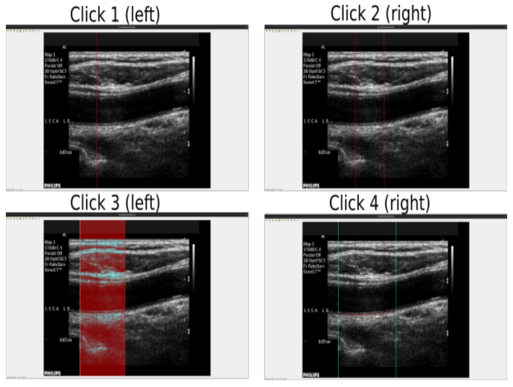
</p>
The function stores the segmentation result in *.txt* file for both *LI* and *MA* interface in two different files.

### *<u> package_cores/run_evaluation_segmentation_full_roi.py </u>*
This function load the results provided by [CUBS database](https://data.mendeley.com/datasets/m7ndn58sv6/1). Run in a terminal:
```sh
python package_cores/run_evaluation_segmentation_full_roi.py -param set_parameters_evaluation_template.py
```
It computes polyline distance, hausdorff distance and save *violin plot*, *box plot* and *cvs*. Below a box plot of the absolute error on intima-media thickness, *LI* and *MA* prediction compared to A1, for each method of CUBS:

<p align="center">
    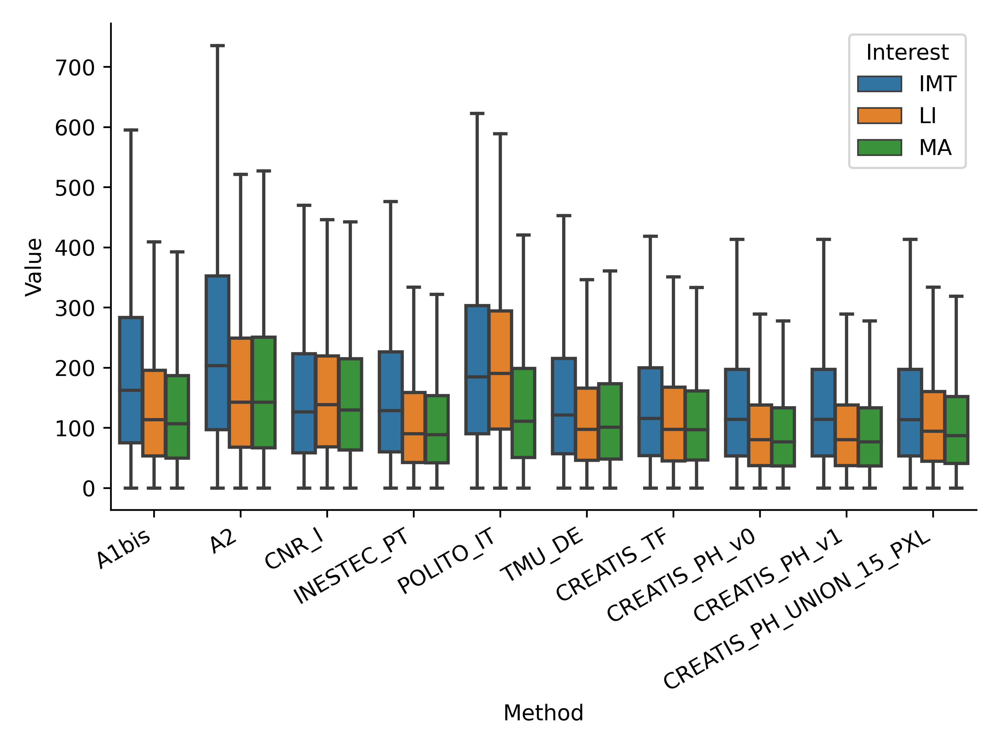
</p>

# caroDeepMotion

*caroDeepMotion* is a patch-based approach to estimate de displacement field between a pair of images of the intima-media complexe in the far of the common carotid artery. *caroDeepMotion/* contains codes for the following application:
* Prepared database based on synthetic sequence of the common carotid artery. It loads results from simulation, remove each unused information for the motion estimation part and save results in *pickle* format.
* Divide simulated images in patches for data augmentation and save results in *pickle* format. 
* Split patient for generating training/validation/testing subset* Training.
* Training.
* Compute the displacement field over a complete image.
* Evaluation.

As before, the code can be run locally and remotely on the cluster. Only locally part will be described, refer to the document for the cluster and/or just look at *caroDeepSeg/run_cluster*.

### *<u> package_cores/run_database_preparation.py </u>*

This function reads the results of the simulation and adapts the results in terms of dimension (it removes some offsets...) and keeps useful information for motion estimation. Run in a terminal:
```sh
python package_cores/run_database_preparation.py -param set_parameters_database_preparation.py
```

### *<u> package_cores/run_database_motion.py </u>*

This function reads the results of *run_database_preparation.py*. It divides each image into isotropic patches. Run in a terminal:
```sh
python package_cores/run_database_motion.py -param set_parameters_database_motion.py
```

This function generate the data used during training. Below an illustration that explains the process: 

<p align="center">
    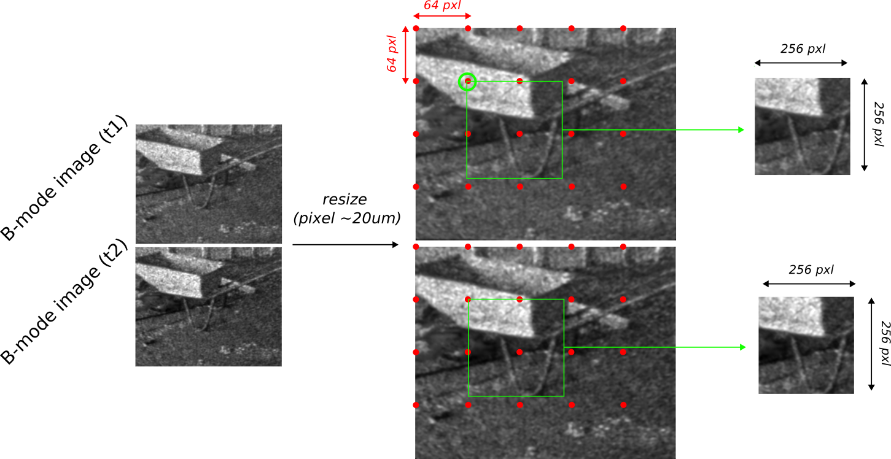
</p>

Each image is splitted into isotropic patches; The size of the patches can be modified in set_parameters_database_motion.py.

### *<u> package_cores/run_training_flow.py </u>*
This function trains model ([RAFT](https://github.com/princeton-vl/RAFT) or [GMA](https://github.com/zacjiang/GMA)). Run in a terminal:
```sh
python package_cores/run_training_flow.py -param set_parameters_training_RAFT_template.py
```

Below an illustration showing the pretraining in flyingChairs. The pre-training phase uses only the training subset, but the validation subset can be added easily.
<p align="center">
    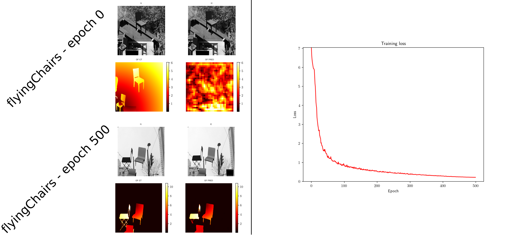
</p>

Then the model can be fine tune on simulated images. This time, the illustration below shows the prediction at the epoch 0 and 30, as well as training and validation loss.
<p align="center">
    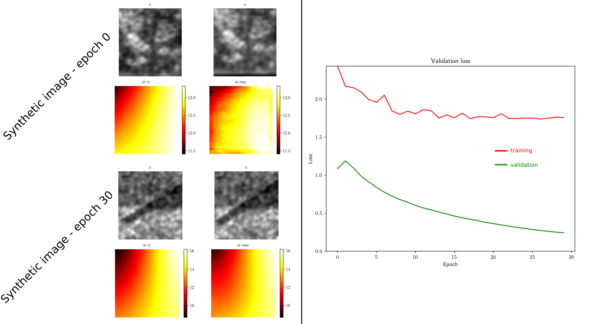
</p>

Note that you can pretrained the architecture based on a different database. A dataloader is already implemented for [flyingChairs](https://lmb.informatik.uni-freiburg.de/resources/datasets/FlyingChairs.en.html). For most efficient pretraining, you can sort results of *flyingChairs* according to the magnitude of the motion with the script:
```sh
python package_debug/run_sort_flyingChairs.py
```
It allows to sort pairs of images lower than a maximal displacement in norm L2.

### *<u> package_cores/run_motion_full_image.py </u>*

The model input is only patches, but it does not predict a full frame dense displacement field. To get the dense displacement field in a full image, run in a terminal:
```sh
python package_cores/run_motion_full_image.py
```
The parameters of this function are directly in *run_motion_full_image.py*, modify them according to your path and preprocessing parameters.

First the image is preprocessed to get the same pixel size that was used during model' training. Then the image is splitted into patches with overlap.  Using an average operator, patches are reasamble to build the displacement field, as you can see in the following illustration:

<p align="center">
    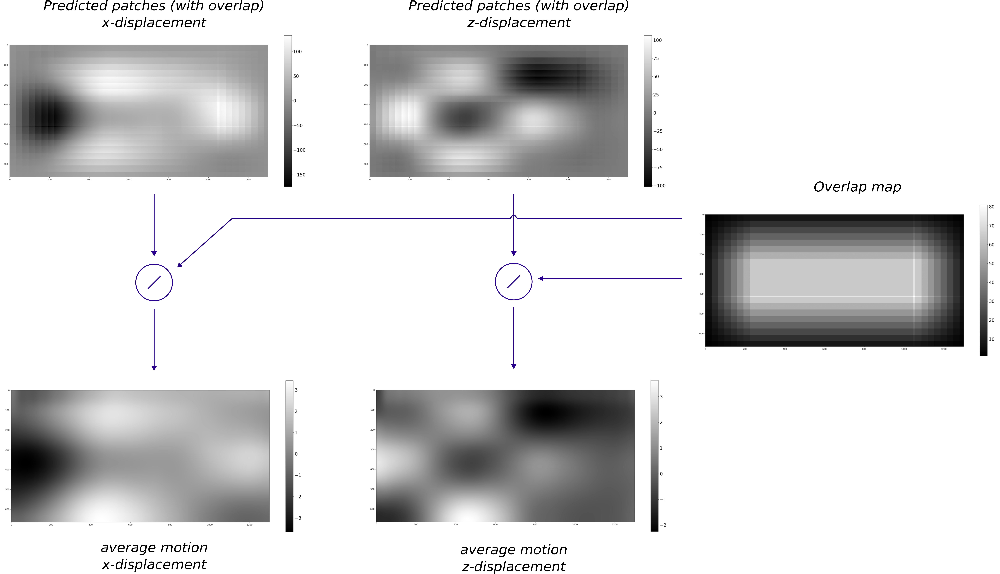
</p>


### *<u> package_cores/run_evaluation.py </u>*

This function compute metrics to assess the quality of the predicted displacement field. It computes motion of the different method:
* Damien Garcia [method](https://hal.archives-ouvertes.fr/hal-02063547/document) (have to be run before, see speckleTracking section before).
* Deep learning approach based on patches.
* Deep learning method based on full images (run *run_motion_full_image.py* before).

It is still work in progress, but you can run the code as follow:
```sh
python package_cores/run_evaluation.py
```
 
# speckleTracking

Here we use other methods in the literature for motion estimation in ultrasound image sequences. For now, only Damien Garcia [method](https://hal.archives-ouvertes.fr/hal-02063547/document) is implemented. Run:
```sh
python run_local/DG_method.m
```

# textureImprovment

*textureImprovment* is a GAN-based approach in order to increase the texture of simulated images. The code organization is exactly the same as for *caroDeepSeg* and *caroDeepMotion*. 
TODO -> complete

# statisticalModelSimulation

This part aims to generate a statistical model of the CCA according to anatomical parts. It could be usefull for data augmentation.

The idea is the following: according to the CUBS database, we retrieve the position of the interfaces and then store the greyscale values of the pixels according to their relative depths for each image in the database. We do the same for the pixels belonging to the adventicia, for those belonging to the lumen, without considering the depth information. By plotting histograms, we noticed that the pixels belonging to the lumen follow a Rayleigh distribution while the others follow a Gaussian distribution, with different parameters depending on the relative depth.

## Pixels belonging to the lumen

First we need to detect the lumen into the image. To this end, a GUI can be used. Run:

```sh
run_lumen_detection.py
```
Adapt the path to load and save the data in *run_lumen_detection.py*.

<p align="center">
    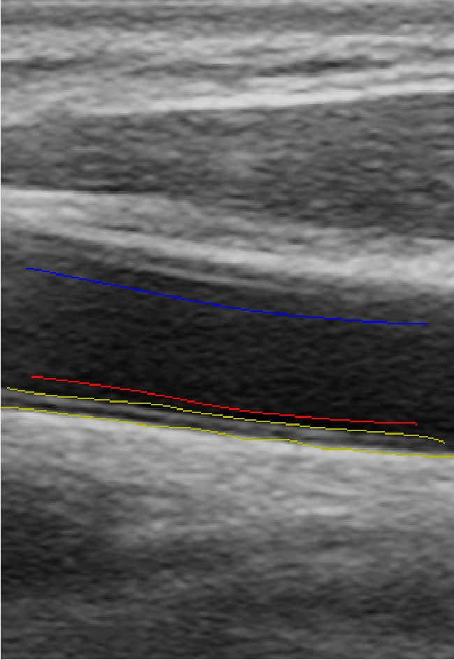
</p>

Below the command of the GUI:
* left click: detect the lower line of the lumen (red) - 4 clicks minimum
* middle click: detect the upper line of the lumen (blue) - 4 clicks minimum
* CTRL + left click: reset
* SHIFT + left click: save the position of the luemen in *.txt* format

## Get statistical information 

The code has to be run as follow:

```sh
python package_cores/run_get_distribution.py -param set_parameters_get_distribution.py
```

### Pixels belong to the IMC

For pixels belonging the IMC, we just consider the relative depth per column. This is computed as follow:
```math
depth_{rel} = \frac{pts_{depth}}{IMC_{depth}} \cdot 100
```
Then the relative depth is sample with integrate value from 0 to 100. 
Below an example explaining the formula above:

<p align="center">
    
</p>

For each column, the relative depth is computed and the gray value is stored. 
Once all images are processed, we plot the histogram depending on the relative depth. We get this below:

<p align="center">
    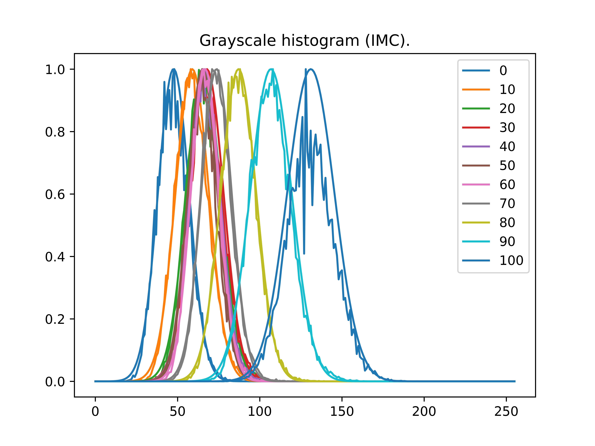
</p>

We noticed that each depth corresponds to a gaussian distribution with different parameters. 
Thus we fit a gaussian for each depth, and save the parameters. 

We apply the same process for pixels belonging to the adventicia, at the difference that the orgine is located at the media-adventicia (MA) interface, and the maximal relative depth (100%) is 10 mm deeper than the MA interface.
For pixels belonging to the lumen, we do not use the depth information. In the lumen, the gray level can be appromated by a rayleigh distribution:
<p align="center">
    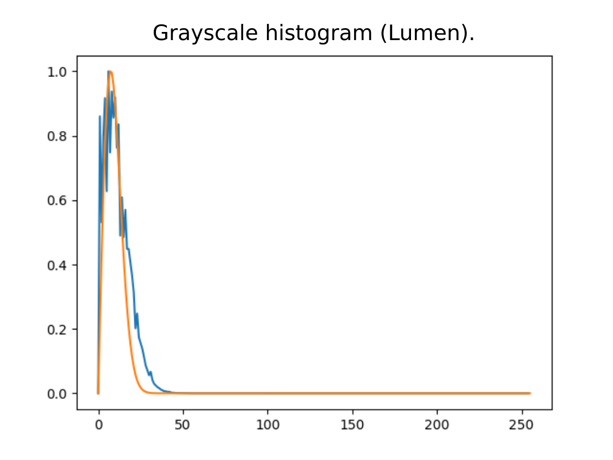
</p>

## Creating statistical images

To generate statistical images, please run the following command:
```sh
python package_cores/run_mk_stat_images.py
```

Add the correct path in *run_mk_stat_images.py*.

The code first open a GUI, which is used to draw the shape of the IMC of the far wall and of the proximal wall. Below the command of the GUI:
* left click: add control point ;
* middle click: delete the last control point ;
* round middle: go to the next step ;

<p align="center">
    
</p>
