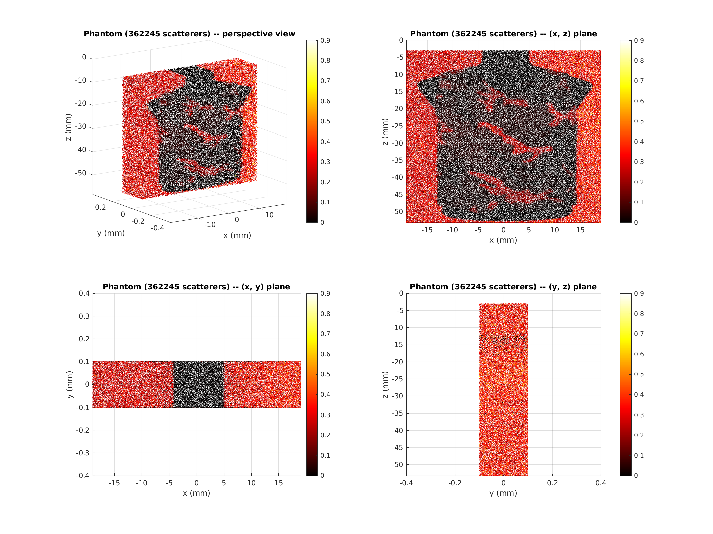

<Head>
    <meta charSet="utf-8" />
</Head>

# Overview

The following REPO provides codes for the following topics:
* SIMULATION
* caroDeepSeg
* caroDeepMotion
* speckleTracking
* textureImprovment

# SIMULATION
All this code run in *matlab* and *cuda*. For one simulation, the process is as follow:
1. Make phantom.
2. Simulation.
3. Beamforming.

The whole process can be performed locally, but the simulation step is very time consuming. Therefore, the phantom and simulation are performed on the CREATIS cluster and the beamforming can be performed locally, provided you have a GPU on your computer.

### run the code locally
The functions to run are in *SIMULATION/run_local*. It contains several functions:
* run_mk_phantom.m
* run_simulation.m
* run_beamforming.m

#### run_local/run_mk_phantom.m
This function call the another function *mtl_cores/fct_run_mk_phantom* which takes as input the path to the database (path to the images), the path to save the phantom, the path to the simulation parameter (.json file) and some additional information (extra_info) to write in the name of the saved file.

The output is structured as follow:
```sh
|── pres/
|    |── img_name/
|    |    |── img_name_id_001_extra_info/
|    |    |    |── bmode_result/               
|    |    |    |    |── results/                (bmode images constructed after beamforming)
|    |    |    |── parameters/                  (copy of the .json to track the parameters)
|    |    |    |── phantom/                     (phantom used for simulation)
|    |    |    |── raw_data/
|    |    |    |    |── exec_/                  (execution time of tx event)    
|    |    |    |    |── raw_/                   (radio frequency (RF) signals for each tx event)
```

Below an example of the generated phantom.
<p align="center">
    
</p>

During the process, a sequence of phantom with a controlled displacement field is applied on the scatterers. The phantom at time *t2* will be stored in:
```sh
|── pres/
|    |── img_name/
|    |    |── img_name_id_002_extra_info/
|    |    |    |── bmode_result/               
|    |    |    |── parameters/
|    |    |    |── phantom/
|    |    |    |── raw_data/
```
Note that depending of the chosen motion, only pair of images can be generated (modify the .json for this purpose):
* elastric displacement field  &rarr; pair of images
* gaussian &rarr;  as pairs as you want
* affine transformation &rarr;  as pairs as you want

Below an exemple of elastic displacement field applied to jacket:

<p align="center">
    
</p>


#### run_local/run_simulation.m
This function has to be run after once the phantom is created. It calls the function *mtl_cores/fct_run_wave_propagation.m*. This one takes as argument the path to the phantom, the path to the parameters and the id of the transmitted element. Then the function writes the radiofrequency(RF) signal in path_res/img_name/img_name_id_001_extra_info/raw_data/_raw. 

Below an example of the generated phantom.

<p align="center">
    
</p>

The simulation applies synthetic aperture. Thus for each id tx, each element of the probe receives signals. The image above are the reveived signal for id tx=1 (left) and for id_tx = 192 (right) for a probe of 192 elements.

#### run_local/run_beamforming.m
This function has to be run at the end. It calls the function *mtl_cores/fct_run_image_reconstruction.m*. The beamforming is performed on GPU.
Below an example of a real image convert to B-mode image (a jacket):
<p align="center">
    
</p>

##### How tu run on GPU?
To run the beamforming on GPU, first check your GPU's architecture. For linux user, run in a terminal:
```sh
nvidia-smi -q | grep Architecture
```
Then you have to compile the '*.cu*' locating in SIMULATION/cuda/*.cu. For this, for Pascal architecture, run:
```sh
bash compile_PASCAL.sh
```
You can easily create a new compile.sh for a different architecture by modidying the sm_xy number by looking in the following [link](https://docs.nvidia.com/cuda/cuda-compiler-driver-nvcc/index.html#gpu-compilation).

### run the code on cluster

The cluster uses *PBS Scheduler*. Once your logged to the cluster, each function is handle by python scripts in *SIMULATION/run_cluster/*. 

#### run_cluster/run_CLUSTER_mk_phantom.py

Change the parameters in *run_CLUSTER_mk_phantom.py*, and it will make the phantom for each image in the database. It can process *TIFF*, *JPEG*, *DICOM*.

#### run_cluster/run_mk_phantom.m

Change the parameters in *run_CLUSTER_mk_phantom.py*, and it will make the phantom for each image in the database. It can process *TIFF*, *JPEG*, *DICOM*.

#### run_cluster/run_CLUSTER_pipeline.py

Change the parameters in *run_CLUSTER_pipeline.py*, and it will run the simulation for each image in the specified directory. It uses a job array, thus each tx element is run in parallel. 

#### run_cluster/run_CLUSTER_beamforming_folders_sta.py

It runs beamforming using GPU's of the cluster. For this purpose, first compile the *.cu* according to the architecture you plan to use, then adapt the flag in SIMULATION/run_cluster/pbs/beamforming_sta.pbs according to the architecture:
```sh
qsub -I -lnodes=1:ppn=1:volta:gpus=1 -qgpu      &rarr;    volta architecture
qsub -I -lnodes=1:ppn=1:turing:gpus=1 -qgpu     &rarr;    turing architecture
qsub -I -lnodes=1:ppn=1:ampere:gpus=1 -qgpu     &rarr;    ampere architecture

```

## Handle simulation results
Once RF signals and the B-mode image are generated, to sort success from the computer to another folder, run:
```sh
run_sort_res.sh
```

Sometimes, tx event fails during simulation. It allows to detect simulation error. After executing the previous function, you can execute the following function, specifying the correct directory to re-run failures:
```sh
python SIMULATION/run_cluster/run_CLUSTER_failures.py
```
Then you have to beamformed the image one more time and run *run_sort_res.sh*.

# caroDeepSeg

*caroDeepSeg* is a patch-based approach to segment the intima-media complexe in the far of the common carotid artery. *caroDeepSeg/* contains codes for the following application:
* Generate database for training.
* Split patient for generating training/validation/testing subset.
* Training.
* Evaluation.

As before, the code can be run locally and remotly on the cluster. Only locally part will be described, refer to the document for the cluster and/or just look at *caroDeepSeg/run_cluster*.

## run the code locally

Each function to run is in the folder *package_cores*. Also, each set of parameters is in *package_parameters*. For example, to run the function *package_cores/run_database_CUBS.py*, modify *package_parameters/set_parameters_database_CUBS.py*.

### package_cores/run_database_CUBS.py

This function split patients into patches. Run in a terminal:
```sh
python package_cores/run_database_CUBS.py -param set_parameters_database_CUBS.py
```
### package_cores/run_database_CUBS.py
This function split patients into training/validation/testing steps. Note that we split patient and not patches. Run in a terminal:
```sh
python package_cores/run_split_data.py
```
For this function only, we do not parse parameters. Please adapt your path to read and save results in *package_cores/run_split_data.py* itself.

### package_cores/run_training_seg.py

This function launch training process. Run in a terminal:
```sh
python package_cores/run_training_seg.py -param set_parameters_training_seg_template.py
```

### package_cores/run_segment_full_roi.py
This function load the trained architecture and apply the full post processing pipeline to segment the intima-media complexe. Run in a terminal:
```sh
python package_cores/run_training_seg.py -param set_parameters_training_seg_template.py
```

### package_cores/run_evaluation_segmentation_full_roi.py
This function load the results provided by [CUBS databse](https://data.mendeley.com/datasets/m7ndn58sv6/1). Run in a terminal:
```sh
python package_cores/run_evaluation_segmentation_full_roi.py -param set_parameters_evaluation_template.py
```
It computes polyline distance, hausdorff distance and save *violin plot*, *box plot* and *cvs*.

# caroDeepMotion

*caroDeepMotion* is a patch-based approach to estimate de displacement field between a pair of images of the intima-media complexe in the far of the common carotid artery. *caroDeepMotion/* contains codes for the following application:
* Prepared database based on synthetic sequence of the common carotid artery. It loads results from simulation, remove each unused information for the motion estimation part and save results in *pickle* format.
* Divide simulated images in patches for data augmentation and save results in *pickle* format. 
* Split patient for generating training/validation/testing subset* Training.
* Training.
* Compute the displacement field over a complete image.
* Evaluation.

As before, the code can be run locally and remotly on the cluster. Only locally part will be described, refer to the document for the cluster and/or just look at *caroDeepSeg/run_cluster*.

### package_cores/run_database_preparation.py

This function reads the results of the simulation and adapts the results in terms of dimension (it removes some offsets...) and keeps useful information for motion estimation. Run in a terminal:
```sh
python package_cores/run_database_preparation.py -param set_parameters_database_preparation.py
```

### package_cores/run_database_motion.py

This function reads the results of *run_database_preparation.py*. It divides each image into isotropic patches. Run in a terminal:
```sh
python package_cores/run_database_motion.py -param set_parameters_database_motion.py
```

This function generate the data used during training.

### package_cores/run_training_flow.py
This function trains model ([RAFT](https://github.com/princeton-vl/RAFT) or [GMA](https://github.com/zacjiang/GMA)). Run in a terminal:
```sh
python package_cores/run_training_flow.py -param set_parameters_training_RAFT_template.py
```
Note that you can pretrained the architecture based on a different database. A dataloader is already implemented for [flyingChairs](https://lmb.informatik.uni-freiburg.de/resources/datasets/FlyingChairs.en.html). For most efficient pretraining, you can sort results of *flyingChairs* according to the magnitude of the motion with the script:
```sh
package_debug/run_sort_flyingChairs.py
```
It allows to sort pairs of images lower than a maximal displacement in norm L2.

### package_cores/run_motion_full_image.py

The model input is only patches, but it does not predict a full frame dense displacement field. Thus this function divides an image into patches with the adapted proprocessing step (resize image) and infer each patches using the trained model, and reasamble each patches to build the dense displacement field using an average operator. Run in a terminal:
```sh
package_cores/run_motion_full_image.py
```
The parameters of this function are directly in *run_motion_full_image.py*, modify them according to your path and preprocessing parameters.

### package_cores/run_evaluation.py

This function compute metrics to assess the quality of the predicted displacement field. It computes motion of the different method:
* Damien Garcia [method](https://hal.archives-ouvertes.fr/hal-02063547/document) (have to be run before, see speckleTracking section before).
* Deep learning approach based on patches.
* Deep learning method based on full images (run *run_motion_full_image.py* before).

As for the previous function, 
# speckleTracking

# textureImprovment
